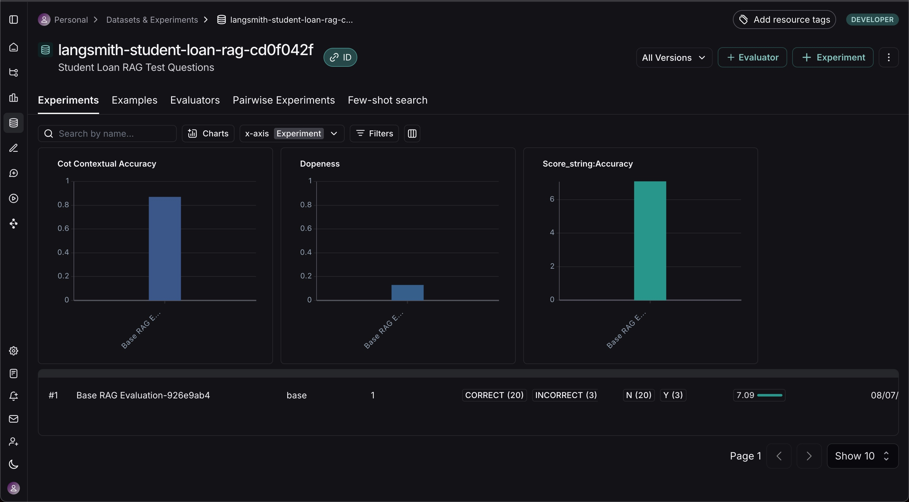

# Introduction to LCEL and LangGraph: LangChain Powered RAG

##### 🏗️ Activity #1:

Below are a few chunking strategies that could be used to improve the quality of retrieval:

1. _**Perform Semantic chunking**_ with an overlap, find natural break points using Semantic Similarity. Ensure the chunk start and finish correctly starting at the beginning of the paragraph and stops at the end of it, so they are complete sentences and there are no abrupt termination of sentences.

2. _**Chunking by taking into account the context or category**_ of the the type of document being chunked. For e.g. depending on the industry the chunking could be adapte i.e. chat conversations - chunk by speaker turns, academic paper - chunk by sections/paragraphs.
Ensure the chunk start and finish correctly starting at the beginning of the paragraph and stops at the end of it, so they are complete sentences and there are no abrupt termination of sentences.

3. _**Metadata enhanced chunking**_: create overlapping chunks where the chunks are independent units and have data that shows continuity of speech, also along with it store additional info (metadata) about the chunks themselves.  Ensure the chunk start and finish correctly starting at the beginning of the paragraph and stops at the end of it, so they are complete sentences and there are no abrupt termination of sentences.

##### ❓ Question #1:

What is the embedding dimension, given that we're using `text-embedding-3-small`? **1536**

You will need to fill the next cell out correctly with your embedding dimension for the rest of the notebook to run.

> HINT: Check out the docs to help you answer this question.

```python
embedding_dim = 1536
```

#### ❓ Question #2:
LangGraph's graph-based approach lets us visualize and manage complex flows naturally. How could we extend our current implementation to handle edge cases? 

For example:
- What if the retriever finds no relevant context? 
    We can create independent functions that check for the presence of relevant context or not. These functions can be added to the graph as nodes, giving the clear names. The adding a conditional node using the `add_conditional_node()` method on `graph_builder`, and passing in all the nodes created earlier. When no relevant context is returned, then this needs to be intercepted and an error be returned, stating why we cannot proceed due to absence of context.
- What if the response needs fact-checking?
Consider how you would modify the graph to handle these scenarios.
    Similar to the above, using the `add_conditional_node()` method on `graph_builder`, add the individual fact checking functions or processes as individual functions and then adding them to the graph.

Here's a simple implementation that can illustrate the above, we are adding a conditional node to check for a state and perform an action if the outcome of the action is `True` or terminate, if it's `False`:

```python
# Add a conditional node
graph_builder.add_conditional_node(
    "maybe_fact_check",  # name of the node
    generate,            # function to run
    needs_fact_check,    # condition function
    {
        True: "fact_check",   # if needs_fact_check returns True, go to fact_check
        False: "END"          # otherwise, end the graph
    }
)
```
---

# LangSmith and Evaluation Overview with AI Makerspace

#### 🏗️ Activity #1:




#### ❓Question #1:

What conclusions can you draw about the above results?

From the graphs on the [LangSmith Dashboard](https://smith.langchain.com/o/4a563880-75b7-483f-b9cd-cf740f81427b/datasets/0120b689-2475-438b-a78e-58fd7c928dc5) we can conclude that using the Student Loan RAG Test Questions dataset, the RAG system scored quite high in CoT Contextaul Accuracy (✅ 0.80 avg -- very good at using the retrieved context to answer questions), quite low on Dopeness (⚠️ 0.13 avg -- responsed were not very comprehensive or impressive in quality) and quite high with Score_string:Accuracy (✅ 7.0 avg -- responses were very similar to the expected ground truth answers).

Describe in your own words what the metrics are expressing.

The metrics are expressing the following:
- CoT Contextaul Accuracy: evaluates the answer/response using reasoning, how well did the RAG system use the context provided to give the answer
- Dopeness: how ellaborate and helpful the answer/response was to the question (by the RAG system)
- Accuracy: how accurate is the answer/response (by the RAG system) when compared to the ground truth